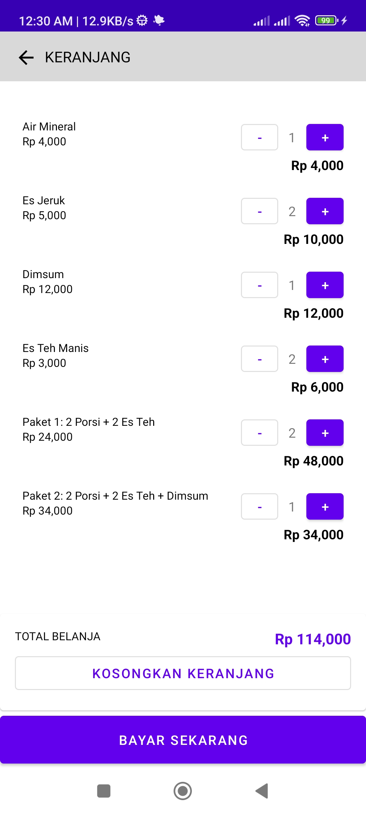
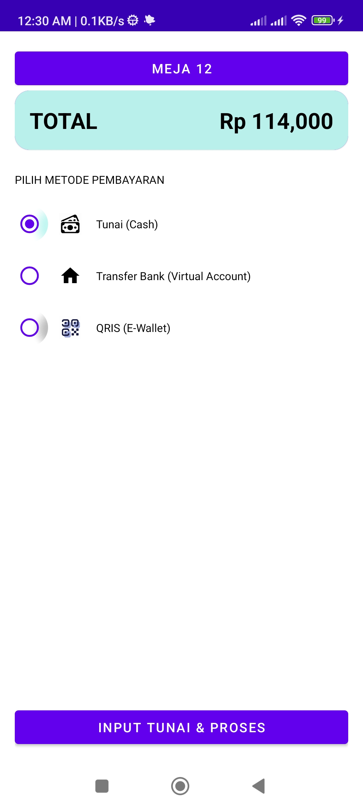
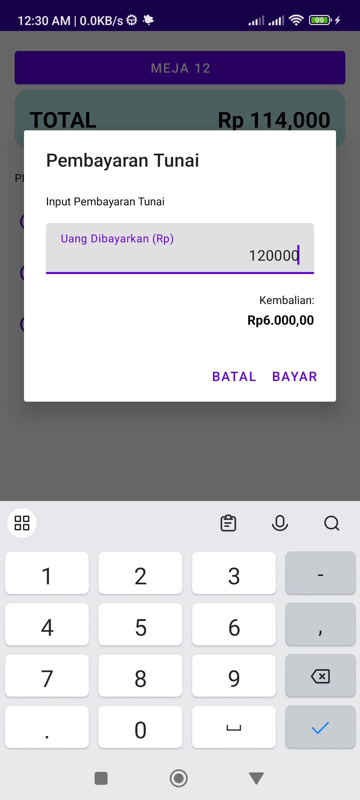
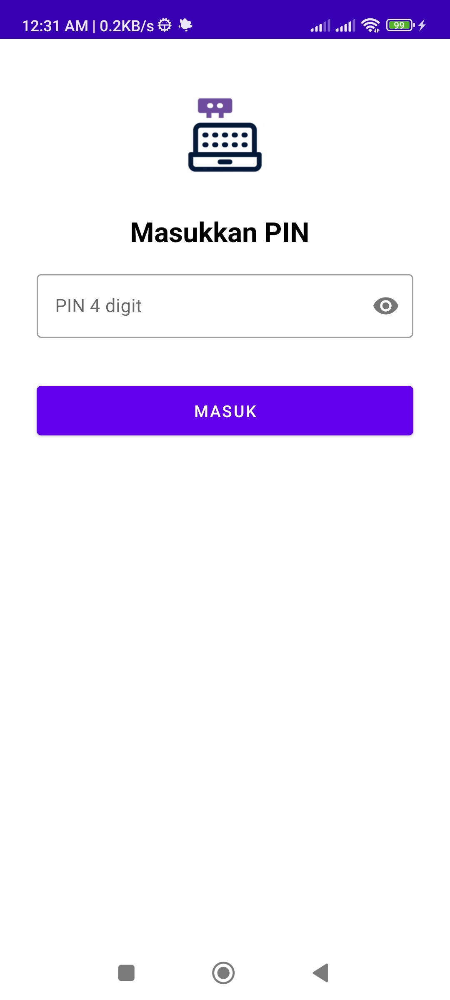
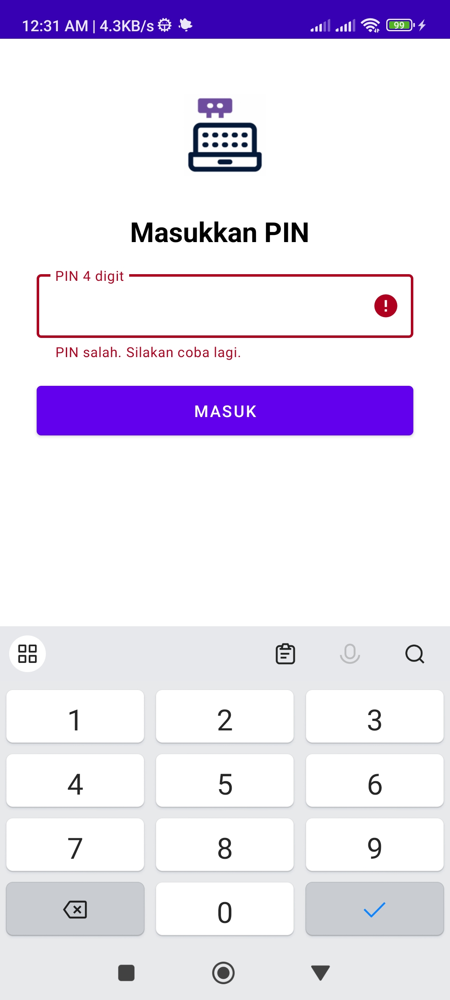

# 💰 MyCashier: Sistem Kasir Sederhana & Lokal (Offline)

**MyCashier** adalah aplikasi kasir (Point of Sale / POS) berbasis **Android** yang dirancang khusus untuk **pedagang kecil, UMKM, dan bisnis tradisional**.  
Aplikasi ini membantu mencatat transaksi harian serta membuat nota secara efisien **tanpa membutuhkan koneksi internet** (*offline-first*).

Tujuan utama MyCashier adalah menggantikan pencatatan manual berbasis kertas, dan penggunaan kalkulator dengan menghafal harga, serta memudahkan pengelolaan **inventaris dan pendapatan harian**.

---

## ✨ Fitur Unggulan

- **💾 Mode Offline Murni**  
  Semua data dan transaksi disimpan secara lokal di perangkat. Tidak memerlukan koneksi internet untuk beroperasi.

- **🔐 Keamanan PIN Lock**  
  Dilengkapi sistem kunci **PIN 4 digit** di awal aplikasi agar hanya pengguna berwenang yang dapat mengakses data.

- **👥 Pencatatan Pelanggan / Meja**  
  Dapat menambahkan nama pelanggan atau nomor meja untuk memudahkan pengelolaan pesanan.

- **📋 Manajemen Menu Sederhana**  
  Tambah, edit, dan hapus item menu dengan cepat melalui antarmuka yang mudah digunakan.

- **🧾 Simulasi Cetak Nota / Struk**  
  Fitur checkout dengan penghitungan otomatis uang tunai dan kembalian, serta tampilan simulasi nota sederhana.

- **💳 Tiga Metode Pembayaran**  
  Mendukung pembayaran **Tunai**, **Transfer Bank**, dan **QRIS (simulasi)**.

- **💳 Halaman administrator (coming soon)**  
  Pengelolaan data dan laporan keuangan yang hanya bisa diakses oleh role administrator**.

---

## 🔒 Mode Kunci (PIN Lock)

Untuk menjaga keamanan data penjualan, aplikasi akan meminta **PIN** setiap kali dibuka.  
Jika PIN benar, pengguna diarahkan ke menu utama aplikasi.

| **Nilai** | **Deskripsi** |
|------------|---------------|
| **PIN Default** | `1234` |
| **Panjang PIN** | 4 digit |

---

## ⚙️ Teknologi yang Digunakan

| Komponen | Teknologi |
|-----------|------------|
| **Bahasa Pemrograman** | Kotlin |
| **Arsitektur** | MVVM (Model - View - ViewModel) |
| **Data Management** | LiveData, Data Binding, ViewModel |


---

## 🛠️ Instalasi dan Penggunaan

### 1️⃣ Clone Repositori
```bash
git clone https://github.com/lukman-bahar-ap/my-simple-cashier.git
```

### 2️⃣ Buka di Android Studio

Jalankan Android Studio versi terbaru
Pilih File → Open Project

Arahkan ke folder hasil clone tadi

### 3️⃣ Jalankan Aplikasi

Sinkronkan Gradle
Jalankan pada emulator atau perangkat fisik Android

### 4️⃣ Akses Awal

Saat pertama kali dijalankan, masukkan PIN default: 1234 untuk membuka menu utama.

<p align="center">
  
  
  
  
  
  

</p>